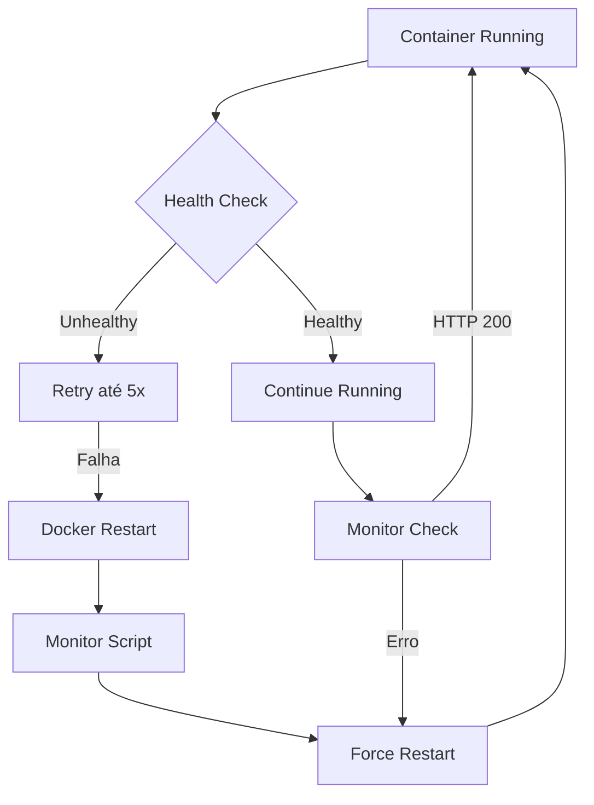

# Estratégia de Estabilidade do Container Docker

## Visão Geral
Este documento descreve as estratégias implementadas para manter o container do The Crypto Frontier estável e disponível 24/7 em https://thecryptofrontier.agentesintegrados.com/

## 🚀 Configurações Implementadas

### 1. Docker Compose - Política de Restart
```yaml
restart: always
```
- O container sempre reiniciará automaticamente em caso de falha
- Garante disponibilidade mesmo após reinicializações do servidor

### 2. Healthcheck Customizado
```yaml
healthcheck:
  test: ["CMD", "node", "healthcheck.js"]
  interval: 30s
  timeout: 15s
  retries: 5
  start_period: 60s
```

#### Script de Healthcheck (healthcheck.js)
```javascript
const http = require('http');

const options = {
  hostname: 'localhost',
  port: 3200,
  path: '/',
  method: 'GET',
  timeout: 5000
};
```
- Verifica se a aplicação está respondendo na porta 3200
- Timeout de 5 segundos para requisições
- Exit code 0 para sucesso, 1 para falha

### 3. Limites de Recursos
```yaml
deploy:
  resources:
    limits:
      memory: 2G
    reservations:
      memory: 1G
```
- Limite máximo de 2GB de RAM
- Reserva mínima de 1GB garantida
- Previne consumo excessivo de memória

### 4. Script de Monitoramento Contínuo

#### monitor-container.sh
```bash
#!/bin/bash
CONTAINER_NAME="thecryptofrontier-app"
LOG_FILE="/var/log/thecryptofrontier-monitor.log"
```

**Funcionalidades:**
- Verifica status do container a cada 60 segundos
- Reinicia automaticamente se unhealthy
- Verifica se o serviço está respondendo via HTTP
- Registra todas as ações em log

**Ações do Monitor:**
1. Verifica se o container está rodando
2. Verifica o health status
3. Testa resposta HTTP na porta 3200
4. Reinicia se necessário
5. Registra logs detalhados

### 5. Melhorias no Dockerfile

```dockerfile
# Copy healthcheck script
COPY --chown=nextjs:nodejs healthcheck.js ./healthcheck.js
```
- Healthcheck integrado à imagem
- Execução com usuário não-root (nextjs)

## 📊 Fluxo de Recuperação



## 🛠️ Comandos Úteis

### Verificar Status
```bash
docker ps | grep thecryptofrontier
docker inspect thecryptofrontier-app --format='{{.State.Health.Status}}'
```

### Ver Logs
```bash
docker logs thecryptofrontier-app --tail=50
tail -f /var/log/thecryptofrontier-monitor.log
```

### Reiniciar Manualmente
```bash
docker-compose restart
# ou
docker restart thecryptofrontier-app
```

### Parar Monitor
```bash
ps aux | grep monitor-container.sh
kill [PID]
```

## 🔍 Troubleshooting

### Container Unhealthy Constante
1. Verificar logs: `docker logs thecryptofrontier-app`
2. Testar manualmente: `curl http://localhost:3200`
3. Verificar memória: `docker stats thecryptofrontier-app`

### Aplicação Não Responde
1. Verificar se a porta 3200 está livre
2. Verificar configurações do Next.js
3. Revisar variáveis de ambiente

### Monitor Não Funciona
1. Verificar se o script está executando: `ps aux | grep monitor`
2. Verificar permissões: `ls -la monitor-container.sh`
3. Ver logs: `tail -f /var/log/thecryptofrontier-monitor.log`

## 📈 Métricas de Estabilidade

O sistema monitora:
- **Uptime**: Container deve ficar online 99.9% do tempo
- **Response Time**: Healthcheck com timeout de 5s
- **Recovery Time**: Máximo 90s para recuperação automática
- **Memory Usage**: Não deve exceder 2GB

## 🔐 Segurança

- Container roda com usuário não-root (nextjs)
- Recursos limitados para prevenir DoS
- Healthcheck não expõe informações sensíveis
- Logs armazenados localmente

## 📝 Manutenção

### Diária
- Verificar logs de erro
- Monitorar uso de memória

### Semanal
- Revisar logs do monitor
- Verificar uptime geral
- Limpar logs antigos

### Mensal
- Atualizar imagem base se necessário
- Revisar limites de recursos
- Otimizar configurações

## 🚨 Alertas

O sistema registra em `/var/log/thecryptofrontier-monitor.log`:
- Container não está rodando
- Container unhealthy
- Serviço não responde
- Reinicializações automáticas

Para implementar alertas externos, pode-se modificar o `monitor-container.sh` para enviar notificações via webhook ou email.

---

**Última atualização:** 23/05/2025
**Maintainer:** Diego Fornalha
**Status:** ✅ Ativo e Monitorado